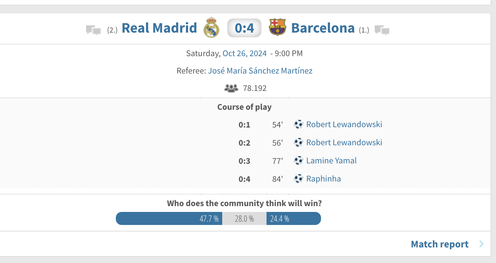
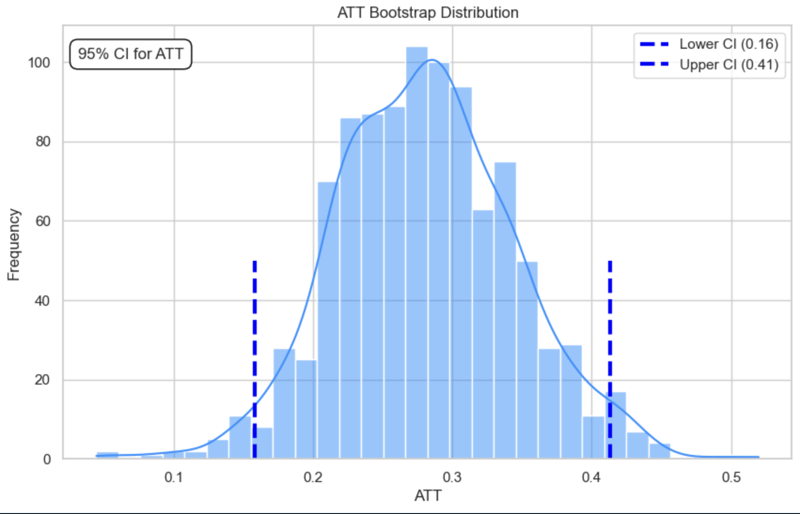
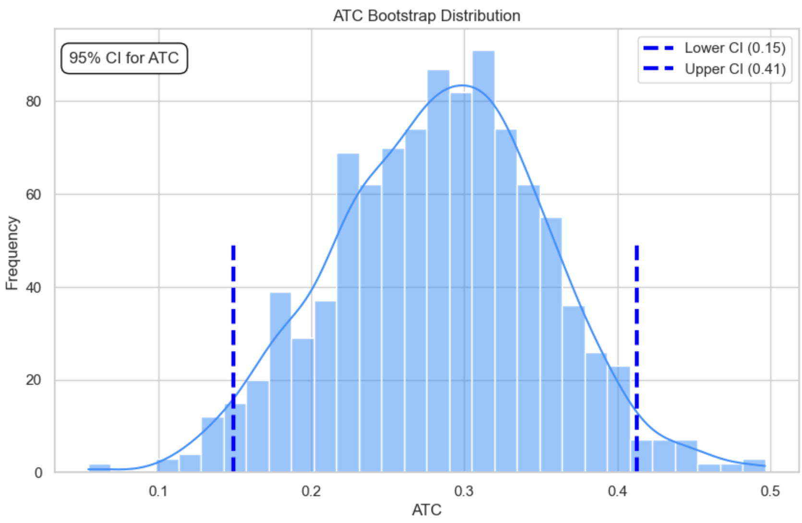

# Home-Field Advantage Hypothesis in Football

## Project Introduction

Football is a sport with a rich history and deep-rooted traditions. One of the most debated and influential rules in football history was the **away goals rule**. Introduced in 1965 for European competitions such as the UEFA Champions League and Europa League, this rule stated that if two teams were tied after two legs (home and away), the team that scored more goals away from home would advance. The away goals rule was designed to encourage attacking play by away teams and to break ties without the need for extra time or penalties. For over 55 years, this rule shaped the strategies of clubs across Europe, leading to countless dramatic moments and tactical innovations.

However, in June 2021, UEFA officially abolished the away goals rule, citing changes in the balance between home and away matches in modern football. The rule was no longer deemed necessary as travel, pitch conditions, and crowd effects had become less pronounced due to advances in technology and stadium infrastructure. With this historic change, the football world began to question: **Does home field advantage still matter?**

This project aims to answer that question by analyzing whether playing at home still provides a statistically significant advantage in terms of goal difference, using data from the top European leagues over the past five years.

---

## Research Question

Does playing on home field significantly impact a team's goal difference in a football match, especially after the abolition of the away goals rule?

### Hypothesis

- **H0:** Playing on home field does not affect a team's goal difference in a match.
- **H1:** Playing on home field has a positive impact on a team's goal difference in a match.

---

## Methodology

Our approach consists of three main stages:

1. **Web scraping** - Extract raw data from Transfermarkt.com
2. **Data extraction** - Use LLMs to extract structured data from raw text
3. **Causal inference** - Apply statistical methods to test our hypothesis

### 1. Web Scraping

We used Selenium to scrape data from [Transfermarkt.com](https://www.transfermarkt.com), a comprehensive football statistics website.

The scraping process involved:
- Selecting countries (England, Germany, France, Spain)
- Navigating to each country's top league
- Gathering data from the last 5 seasons (excluding 2024/25)
- Extracting match information from both matchday overviews and matchday reports
- Saving data continuously to JSON files

Example of a matchday display:

### 2. Data Extraction with LLMs

We used Large Language Models through the Langchain framework to extract structured data from the raw text scraped from Transfermarkt.

The process was divided into two stages:
1. **First stage**: Extract information about complete matches (including both home and away teams)
2. **Second stage**: Extract information about each team's performance in each match

#### First Stage (Match Information Extraction)

We created a `Match` class with the following attributes:
- `matchday_order`: The order of the matchday in the season
- `home_team`: The name of the home team
- `home_team_position`: The home team's position in the league table
- `home_team_score`: The number of goals scored by the home team
- `away_team`: The name of the away team
- `away_team_position`: The away team's position in the league table
- `away_team_score`: The number of goals scored by the away team
- `home_team_starting_lineup`: Formation of the home team
- `away_team_starting_lineup`: Formation of the away team
- `community_prediction_home_team_win`: Community prediction percentage for home team win
- `community_prediction_draw`: Community prediction percentage for a draw
- `community_prediction_away_team_win`: Community prediction percentage for away team win
- `date`: Date of the match
- `referee`: Name of the match referee

#### Second Stage (Team Performance Extraction)

For each match, we created two `TeamMatch` objects (one for each team) with the following attributes:
- `matchday_order`: The order of the matchday in the season
- `date`: Date of the match
- `team_name`: Name of the team
- `pitch`: Whether the team played at home or away ('Home' or 'Away')
- `position`: The team's position in the league table
- `position_of_opponent`: The opponent's position in the league table
- `starting_line_up`: The team's formation
- `starting_line_up_opponent`: The opponent's formation
- `win_vote`: Community prediction percentage for the team to win
- `draw_vote`: Community prediction percentage for a draw
- `referee`: Name of the match referee
- `result`: Match result for this team ('Win', 'Draw', or 'Lose')
- `difference_of_score`: Goal difference (team score - opponent score)

### 3. Causal Inference

To determine if there is a causal relationship between playing at home and goal difference, we used Propensity Score Matching (PSM).

#### Feature Engineering and Preprocessing

- Encoded the pitch variable (1 for home, 0 for away)
- Extracted the month from match dates
- Standardized numerical features (win vote, draw vote)
- Converted categorical variables to dummy variables for modeling

#### Propensity Score Matching (PSM) Implementation

- Used logistic regression to calculate propensity scores for each observation (probability of playing at home)
- Verified the common support region between treatment (home) and control (away) groups to ensure valid matching
- Built counterfactuals for both treatment group (home teams) and control group (away teams)
- Calculated Average Treatment Effect on the Treated (ATT) and Average Treatment Effect on the Control (ATC)
- Validated matching quality with distribution plots
- Conducted t-tests and bootstrap confidence intervals to assess statistical significance

---

## Results and Insights

### 1. Data Exploration

- **Top teams with most wins:** Barcelona, Manchester City, Arsenal, Atlético Madrid, PSG, Liverpool, Bayern Munich, Monaco, Man Utd, Real Madrid.
- **Teams with most losses:** Everton, FC Augsburg, Wolves, Celta de Vigo, Aston Villa, Crystal Palace, FC Nantes, West Ham, Alavés, Southampton.
- **Best overall goal difference:** Manchester City.
- **Worst overall goal difference:** FC Schalke 04 (now relegated).
- **Most popular tactical formation:** 4-2-3-1, reflecting a modern trend of midfield control.

### 2. Home Field Analysis

- **Home teams are consistently predicted to have a higher win probability than away teams.**
- The distribution of win prediction percentages is highly uneven: strong teams often have many matches with a 100% win prediction, while weak teams are often rated very low (0-30%).
- The 4-2-3-1 formation was the most commonly used tactical setup, showing a preference for midfield dominance and flexibility.

### 3. Hypothesis Testing Results

- **After applying Propensity Score Matching to balance confounders between home and away groups:**
  - The average goal difference for home teams is higher than for away teams.
  - T-test results show this difference is statistically significant (p-value < 0.05).
  - The 95% confidence intervals for ATT (Average Treatment Effect on the Treated) and ATC (Average Treatment Effect on the Control) are strictly positive and do not include zero.
  - Specifically, **playing at home increases a team's goal difference by 0.149 to 0.413 goals per match** with 95% confidence.

#### ATT Distribution:

#### ATC Distribution:

### 4. Conclusion

- **Home field advantage still has a positive and statistically significant effect on a team's goal difference, even after the away goals rule was abolished.**
- This suggests that factors such as home crowd support, pitch familiarity, and reduced travel still play an important role in modern football.
- The effect size (0.15 to 0.41 goals per match) is meaningful in the context of professional football, where matches are often decided by a single goal.

---

## Team Members

- **Nguyễn Hồng Sơn** (22280078): Used LLM for structured data extraction
- **Trần Chí Hữu** (22280038): Web scraped raw data
- **Võ Minh Thịnh** (22280087): Applied causal inference for hypothesis testing
- **Nguyễn Phạm Anh Văn** (22280104): Applied causal inference for hypothesis testing

**Team Leader:** Nguyễn Hồng Sơn (22280078)

---

## References

- [UEFA officially abolishes the away goals rule](https://www.uefa.com/insideuefa/news/026a-12733e7c1b7c-2e7e2b7b1c2d-1000/)
- [Transfermarkt](https://www.transfermarkt.com)
- [Langchain Documentation](https://python.langchain.com/)
- [Propensity Score Matching in Causal Inference](https://en.wikipedia.org/wiki/Propensity_score_matching)